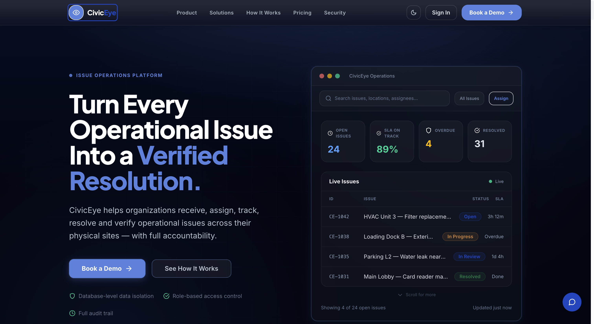
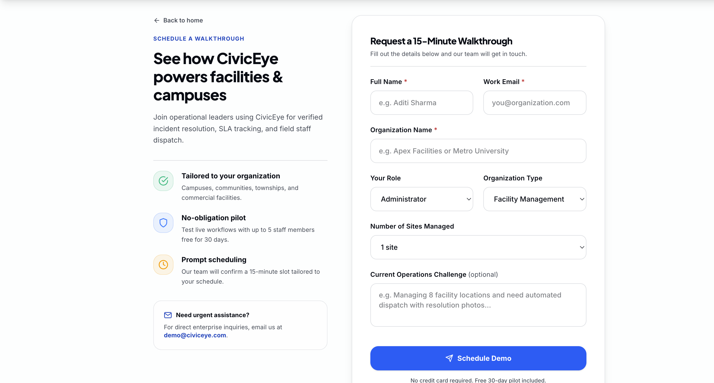
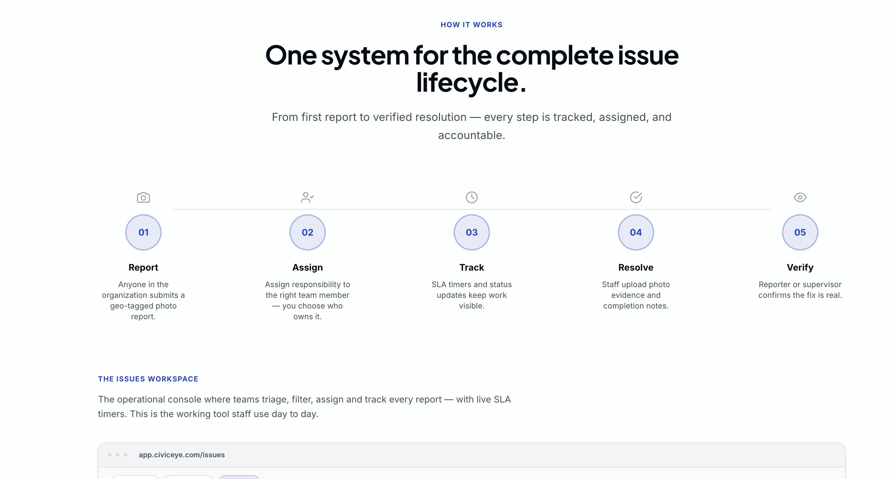
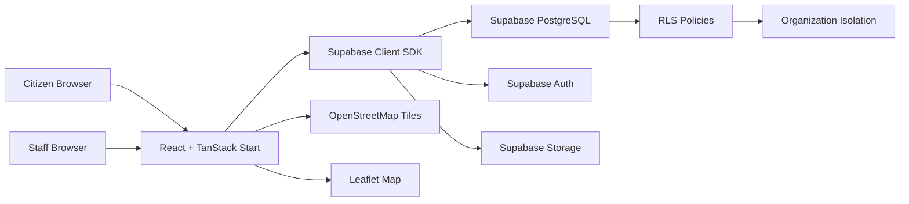

# CivicEye

A multi-tenant civic issue management platform that lets organizations receive, assign, track, and resolve facility and infrastructure issues -- with SLA tracking, evidence-based resolution, and role-based access control.

---

## Table of Contents

- [Overview](#overview)
- [Screenshots](#screenshots)
- [Demo](#demo)
- [Core Features](#core-features)
- [How It Works](#how-it-works)
- [How to Use CivicEye](#how-to-use-civiceye)
- [Installation](#installation)
- [Environment Variables](#environment-variables)
- [Project Structure](#project-structure)
- [Tech Stack](#tech-stack)
- [Testing & Quality](#testing--quality)
- [Troubleshooting](#troubleshooting)
- [Security](#security)
- [Known Limitations](#known-limitations)
- [Future Improvements](#future-improvements)
- [License](#license)

---

## Overview

Municipalities, campus facilities, and property management teams struggle to track civic issues -- potholes, water leaks, broken streetlights -- across distributed teams. Citizen reports get lost, SLAs are missed, and accountability is unclear.

CivicEye solves this by providing:

- A **citizen-facing reporting flow** where anyone can submit an issue with a photo, GPS location, and category
- A **staff dashboard** where administrators assign, track, and resolve issues with photographic evidence
- **SLA tracking** to ensure issues are addressed within defined response and resolution windows
- **Multi-tenant isolation** so each organization's data stays separate

**Intended for:** Facility managers, campus administrators, municipal operations teams, and ward-level government staff.

---

## Screenshots

### Landing Page



### Book a Demo



### How It Works



---

## Demo

There is no live deployment currently available. The project runs locally after setup.

**To run the demo locally:**

1. Follow the [Installation](#installation) steps below
2. Start the dev server with `bun run dev`
3. Open `http://localhost:3000` in your browser
4. The landing page loads at `/`
5. Navigate to `/report` to try the citizen reporting flow
6. Sign in at `/login` to access the staff dashboard (`/dashboard`) and reports queue (`/reports`)

**Main user journey:**

```
Landing page --> /report (submit issue) --> /reports (track status)
                                            /dashboard (staff: manage & resolve)
                                            /map (view all issues geographically)
```

---

## Core Features

### Citizen Reporting (`/report`)

- **4-step guided wizard:** Photo Evidence > Category > Location > Review & Submit
- Camera capture on mobile, file upload on desktop (8 MB max, JPG/PNG/WebP)
- Interactive Leaflet map for precise GPS location selection
- Category suggestions based on filename keywords (AI placeholder)
- Reference ID generation with copy-to-clipboard
- Resolution verification -- citizens can confirm or reopen after staff resolution

### Staff Dashboard (`/dashboard`)

- Stat cards: open issues, assigned count, SLA overdue, SLA compliance %
- Charts: reports by category (pie chart) and status (bar chart)
- Issue queue with SLA overdue alerts and unassigned intake
- Resolution verification queue
- Recent reports table with inline actions

### Reports Queue (`/reports`)

- Full-text search across title, description, location, and reference ID
- Filters: category, status, assignment (all/me/assigned/unassigned), SLA overdue
- Sort by newest or oldest
- Desktop: table layout with image thumbnail, status, SLA badge, actions
- Mobile: card layout with responsive design
- Click any row to view full issue details, evidence comparison, and activity history

### Interactive Map (`/map`)

- Full-viewport OpenStreetMap with Leaflet
- Color-coded markers by status (amber/pending, blue/in-progress, green/resolved)
- Fly-to animation on issue selection
- Searchable, filterable sidebar panel synced with map markers

### Issue Lifecycle

- **Status workflow:** Pending > In Progress > Resolved > Verified / Closed / Reopened
- Staff assignment with assigner tracking and timestamps
- Evidence-based resolution: staff upload "after" photos with notes
- Before/after evidence comparison in issue detail view
- Full audit trail of status changes (who, when, notes)

### Multi-Tenant Organization Management

- Organization-scoped data with Supabase Row Level Security
- Departments and wards within organizations
- Subscription tiers: Free Pilot (30 days), Community, Growth, Enterprise
- Plan limits on staff count, reports per month, department count
- Onboarding flow for new organizations

### Authentication & Authorization

- Email/password authentication via Supabase Auth with email confirmation
- Four roles: `citizen`, `ward_officer`, `admin`, `super_admin`
- Staff-only pages gated behind role checks
- Subscription paywall for inactive organizations

### Marketing & Public Pages

- Landing page with hero, solutions, product tour, FAQ, pricing
- Pricing page with tier comparison and FAQ accordion
- Static pages: Privacy Policy, Terms of Service, Security, How It Works
- Demo request form for enterprise prospects

---

## How It Works

```
Citizen submits report
  |
  v
Frontend (React + TanStack Start)
  |-- Photo uploaded to Supabase Storage
  |-- Report record created in Supabase PostgreSQL
  |-- Category suggested via filename-keyword classifier
  |
  v
Staff dashboard receives new report
  |-- Admin assigns to staff member
  |-- Status changes to "In Progress"
  |
  v
Staff resolves issue
  |-- Uploads evidence photo
  |-- Adds resolution notes
  |-- Status changes to "Resolved"
  |
  v
Citizen verifies resolution
  |-- Approves -> "Verified" (closed)
  |-- Rejects -> "Reopened" (back to staff)
```

All data flows through the Supabase client SDK. The frontend reads and writes directly to Supabase; there is no custom backend API server. Row Level Security policies on the database enforce organization isolation and role-based access.

### Architecture



---

## How to Use CivicEye

### For Citizens / Reporters

1. Open the application in your browser
2. Navigate to **Report an Issue** (`/report`)
3. **Step 1 -- Photo Evidence:** Tap the upload area to capture a photo with your camera (mobile) or select a file (desktop). Accepted formats: JPG, PNG, WebP (max 8 MB)
4. **Step 2 -- Category:** Select the issue category (Pothole, Garbage, Fallen Tree, Water Leakage, Broken Street Light, Road Damage, or Other). If you uploaded a photo, the system may suggest a category automatically
5. **Step 3 -- Location:** Allow GPS access to auto-detect your location, or tap on the interactive map to pin the exact spot
6. **Step 4 -- Review:** Review your report details. Optionally add a title, description, or landmark name
7. **Submit:** Tap "Submit report to operations". You'll receive a **reference ID** -- save it to track your report
8. **Track status:** Visit `/reports` to check your report's status. When staff mark it resolved, you can verify the fix or reopen the issue

### For Staff / Administrators

1. **Sign in** at `/login` with your organization email and password
2. **Dashboard** (`/dashboard`): View open issues, SLA compliance, overdue alerts, and recent activity at a glance
3. **Reports queue** (`/reports`): Browse all reports. Use filters to find unassigned, overdue, or category-specific issues
4. **Assign issues:** Click "Assign" on a pending report to delegate it to a staff member
5. **Resolve issues:** For "In Progress" reports, click "Resolve" to upload evidence photos and resolution notes
6. **Verify resolutions:** Review submitted evidence and approve or reject (reopen) the resolution
7. **Map view** (`/map`): See all issues plotted geographically. Click markers for quick details

### For Super Admins

- All staff capabilities plus organization-level management
- Subscription and billing configuration
- Staff role assignment and department management

---

## Installation

### Prerequisites

- [Bun](https://bun.sh/) (recommended) or Node.js 18+
- A [Supabase](https://supabase.com/) project (free tier works)
- Git

### 1. Clone the Repository

```sh
git clone https://github.com/Adib-07/Civic-eye.git
cd Civic-eye
```

### 2. Install Dependencies

```sh
bun install
```

> The project uses Bun as its primary package manager. A `bun.lock` file is included. Using `npm install` is also supported but Bun is recommended.

### 3. Set Up Environment Variables

```sh
cp .env.example .env.local
```

Edit `.env.local` and fill in your Supabase credentials:

```env
VITE_SUPABASE_URL=https://your-project.supabase.co
VITE_SUPABASE_ANON_KEY=your-anon-key
VITE_DEFAULT_ORGANIZATION_ID=your-organization-id
```

See [Environment Variables](#environment-variables) for the full list of supported variables.

### 4. Set Up the Database

Run the SQL migrations in `supabase/migrations/` against your Supabase project. The migrations are numbered sequentially (`001` through `010`) and should be applied in order.

You can run them via the [Supabase Dashboard SQL Editor](https://supabase.com/dashboard/project/_/sql/new) or using the Supabase CLI.

### 5. Start the Development Server

```sh
bun run dev
```

The app will be available at `http://localhost:3000` (or the port Vite selects).

### 6. Build for Production

```sh
bun run build
```

### 7. Preview Production Build

```sh
bun run preview
```

---

## Environment Variables

| Variable | Required | Purpose | Example |
|----------|----------|---------|---------|
| `VITE_SUPABASE_URL` | **Yes** | Supabase project URL | `https://abc123.supabase.co` |
| `VITE_SUPABASE_ANON_KEY` | **Yes** | Supabase anon/publishable key | `eyJhbGciOi...` |
| `VITE_DEFAULT_ORGANIZATION_ID` | **Yes** | Organization UUID for routing citizen reports | `a1b2c3d4-...` |
| `VITE_SUPABASE_PROJECT_ID` | No | Alternative to `VITE_SUPABASE_URL` (derives URL from project ID) | `abc123` |
| `VITE_SUPABASE_PUBLISHABLE_KEY` | No | Alternative to `VITE_SUPABASE_ANON_KEY` (Lovable-linked projects) | `eyJhbGciOi...` |
| `VITE_BILLING_PROVIDER` | No | Billing provider: `none`, `manual`, or `stripe` | `none` |
| `VITE_BILLING_CHECKOUT_ENABLED` | No | Enable/disable billing checkout flow | `false` |
| `VITE_MAP_TILE_URL` | No | Custom map tile URL (defaults to OpenStreetMap) | `https://tile.openstreetmap.org/{z}/{x}/{y}.png` |
| `VITE_MAP_TILE_ATTRIBUTION` | No | Custom map tile attribution string | `&copy; OpenStreetMap` |

See `.env.example` for the required template. **Never commit real credentials to version control.**

---

## Project Structure

```
Civic-eye/
├── public/                     Static assets (favicon, hero images)
├── src/
│   ├── components/
│   │   ├── landing/            Landing page sections (hero, tour, pricing, FAQ, etc.)
│   │   ├── ui/                 shadcn/ui component primitives
│   │   ├── MapView.tsx         Full-viewport Leaflet map
│   │   ├── LocationPicker.tsx  Interactive GPS coordinate picker
│   │   ├── ReportMiniMap.tsx   Small map for report details
│   │   ├── AssignDialog.tsx    Staff assignment dialog
│   │   ├── ResolveIssueDialog.tsx  Resolution evidence upload
│   │   ├── VerifyDialog.tsx    Resolution verification
│   │   ├── IssueWorkflowBar.tsx    Status workflow visualization
│   │   ├── SlaBadge.tsx        SLA status indicator
│   │   ├── StatusBadge.tsx     Issue status badge
│   │   └── ...                 Other business components
│   ├── hooks/                  Custom React hooks
│   ├── lib/
│   │   ├── auth.ts             Supabase auth + session management
│   │   ├── reports.ts          Report CRUD, assignment, resolution, evidence
│   │   ├── supabase.ts         Supabase client singleton
│   │   ├── env.ts              Environment variable helpers
│   │   ├── types.ts            TypeScript types, roles, categories
│   │   ├── ai.ts               Filename-keyword category classifier
│   │   ├── map-config.ts       Map tile configuration
│   │   └── database.types.ts   Auto-generated Supabase DB types
│   ├── routes/                 File-based TanStack Router pages
│   ├── router.tsx              Router factory with QueryClient
│   ├── routeTree.gen.ts        Auto-generated route tree
│   ├── server.ts               SSR entry (Nitro/h3)
│   └── styles.css              Tailwind theme + custom design system
├── supabase/
│   └── migrations/             SQL migrations (schema, RLS, subscriptions)
├── docs/                       Architecture, security, and setup docs
├── package.json
├── vite.config.ts
├── tsconfig.json
├── vercel.json
├── bun.lock
├── .env.example
└── .gitignore
```

### Key Directories

| Directory | Purpose |
|-----------|---------|
| `src/routes/` | All application pages (file-based routing via TanStack Router) |
| `src/components/` | Reusable UI components (business logic + shadcn/ui primitives) |
| `src/lib/` | Core modules: auth, data fetching, types, utilities |
| `supabase/migrations/` | Database schema migrations (apply in order 001-010) |
| `docs/` | Internal documentation (architecture, security, setup guides) |
| `public/assets/` | Static images used on the landing page |

### Key Routes

| Route | Page | Access |
|-------|------|--------|
| `/` | Landing page | Public |
| `/report` | Submit a civic issue | Public |
| `/reports` | Browse and manage reports | Public (limited) / Staff (full) |
| `/dashboard` | Operations dashboard | Staff only |
| `/map` | Interactive issue map | Public |
| `/login` | Sign in | Public |
| `/signup` | Create account | Public |
| `/pricing` | Pricing plans | Public |
| `/book-demo` | Request a demo | Public |
| `/onboarding` | Organization setup | Public |

---

## Tech Stack

| Layer | Technology |
|-------|-----------|
| **Framework** | React 19, TanStack Start 1.168, TanStack Router 1.170 |
| **State/Data** | TanStack React Query 5.101, Supabase JS Client 2.112 |
| **Styling** | Tailwind CSS 4.2, shadcn/ui (New York style), Framer Motion 12 |
| **UI Components** | shadcn/ui primitives, Radix UI, Lucide React icons |
| **Maps** | Leaflet 1.9, React Leaflet 5, OpenStreetMap tiles |
| **Charts** | Chart.js 4.5, Recharts 2.15 |
| **Forms** | React Hook Form 7, Zod 3, @hookform/resolvers |
| **Database** | Supabase PostgreSQL with Row Level Security |
| **Auth** | Supabase Auth (email/password with confirmation) |
| **Storage** | Supabase Storage (image uploads) |
| **Build** | Vite 8, Nitro 3, TypeScript 5.8 |
| **Linting** | ESLint 9 with Prettier, React Hooks + React Refresh plugins |
| **Package Manager** | Bun (with npm lock fallback) |
| **Deployment** | Vercel (configured via `vercel.json`) |

---

## Testing & Quality

```sh
# Linting
bun run lint

# Type checking
bun run typecheck

# Format code
bun run format

# Production build verification
bun run build
```

| Check | Command | Status |
|-------|---------|--------|
| Linting | `bun run lint` | Passes |
| Type checking | `bun run typecheck` | Passes cleanly |
| Production build | `bun run build` | Builds successfully |
| Formatting | `bun run format` | Available via Prettier |
| CI | `.github/workflows/ci.yml` | Lint, typecheck, and build on push/PR |
| Automated tests | -- | **Not configured** (no test runner or test files) |

> **Note:** No automated test suite is currently configured. CI runs lint, typecheck, and build verification on every push and pull request.

---

## Troubleshooting

### "Supabase is not configured" warning

If you see a configuration warning on the report or login pages, your environment variables are missing or set to placeholder values.

**Fix:** Ensure `.env.local` exists (copy from `.env.example`) and contains real Supabase credentials. The app validates against placeholder values like `your-anon-key` and `https://your-project.supabase.co`.

### Login fails with "Invalid login credentials"

- Verify your email and password are correct
- Check that you have confirmed your email address (check inbox/spam for verification link)
- If you see "email not confirmed", use the "Resend confirmation email" button on the login page

### "Staff profile not linked" error on dashboard

Your Supabase `profiles` table row must have `organization_id` set to your organization's UUID. This is typically set during signup or by an administrator.

### Reports page shows "Organization not configured"

Set `VITE_DEFAULT_ORGANIZATION_ID` in your `.env.local` to the UUID of your Supabase organization record. This is required for routing citizen reports.

### Map tiles not loading

By default, CivicEye uses OpenStreetMap tiles. If tiles fail to load:
- Check your internet connection
- Verify `VITE_MAP_TILE_URL` is not set to an invalid custom tile server
- OpenStreetMap may rate-limit heavy usage -- consider setting a custom tile URL for production

### Build fails

1. Run `bun install` to ensure all dependencies are installed
2. Run `bun run typecheck` to identify TypeScript errors
3. Run `bun run lint` to check for code quality issues
4. Clear the `.output` and `.tanstack` directories if they exist, then rebuild

### Dev server won't start

- Ensure port 3000 (or your configured port) is not in use
- Try `bun run dev -- --port 3001` to use an alternate port
- Check the terminal output for specific error messages

---

## Security

- **Row Level Security (RLS):** Supabase RLS policies enforce organization-level data isolation. Staff can only see their organization's data; citizens are routed to their configured organization.
- **Role-Based Access Control:** Four roles (`citizen`, `ward_officer`, `admin`, `super_admin`) with granular permissions. Staff-only pages are gated behind role checks.
- **Auth:** Supabase Auth with email/password, session persistence, auto-refresh tokens, and email confirmation flow.
- **No Service Role Keys:** The client only uses the Supabase anon/publishable key. Service role keys are never exposed to the browser.
- **Environment Variables:** Secrets are excluded from version control via `.gitignore`. The `env.ts` module validates against placeholder values and warns when configuration is missing.
- **RLS Hardening:** Dedicated migration (`003_rls_hardening.sql`) tightens policies beyond defaults.

For detailed security documentation, see [`docs/SECURITY_PHASE3.md`](docs/SECURITY_PHASE3.md) and [`docs/RLS_VERIFICATION.md`](docs/RLS_VERIFICATION.md).

---

## Known Limitations

- **AI categorization is a placeholder.** The `predictCategory` function in `src/lib/ai.ts` classifies issues by filename keywords, not actual image analysis. The codebase is architected for real vision API integration (`ai_category` and `ai_confidence` fields exist in the schema).
- **No automated tests.** No test runner, test files, or test configuration exists.
- **No real-time updates.** The dashboard does not use Supabase Realtime subscriptions; data refreshes on page load.
- **Subscription billing is structural only.** The schema supports Stripe integration (`VITE_BILLING_PROVIDER`), but no payment processing is implemented.
- **Single Supabase project per deployment.** Multi-tenancy is at the application level (organization scoping), not infrastructure level.
- **Image uploads go directly to Supabase Storage from the browser.** No server-side validation of file content beyond MIME type checks.

---

## Future Improvements

- Integrate a real computer vision API (e.g., OpenAI Vision, Google Cloud Vision) for automatic issue categorization from photos
- Add Supabase Realtime subscriptions for live dashboard updates
- Implement Stripe payment processing for subscription tiers
- Add automated tests (unit, integration, E2E)
- Add email/SMS notifications for status changes
- Implement analytics and reporting dashboards with historical trends
- Add bulk operations for staff (mass assignment, bulk status changes)

---

## License

This project is licensed under the MIT License. See [LICENSE](LICENSE) for details.
