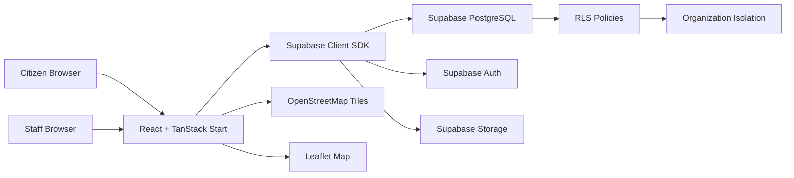

# CivicEye

Multi-tenant civic issue management platform with SLA tracking, evidence-based resolution, and role-based access control. Built with React, TanStack, Supabase, and Leaflet.

---

## Overview

Municipalities, campus facilities, and property management teams struggle to track civic issues -- potholes, water leaks, broken streetlights -- across distributed teams. Reports get lost, SLAs are missed, and accountability is unclear.

CivicEye solves this with:

- A **citizen-facing reporting flow** where anyone can submit an issue with a photo, GPS location, and category
- A **staff dashboard** where administrators assign, track, and resolve issues with photographic evidence
- **SLA tracking** to ensure issues are addressed within defined response and resolution windows
- **Multi-tenant isolation** so each organization's data stays separate

**Intended for:** Facility managers, campus administrators, municipal operations teams, and ward-level government staff.

---

## Live Demo

**[https://civic-eye-alpha.vercel.app](https://civic-eye-alpha.vercel.app)**

> The demo is deployed on Vercel. Staff features require a Supabase backend with seeded data. The citizen reporting flow (`/report`) works without authentication.

---

## Screenshots

### Landing Page


### Login


### Citizen Report Form


---

## Core Features

### Citizen Reporting (`/report`)

- **4-step guided wizard:** Photo Evidence > Category > Location > Review & Submit
- Camera capture on mobile, file upload on desktop (8 MB max, JPG/PNG/WebP)
- Interactive Leaflet map for precise GPS location selection
- Category suggestions based on filename keywords (placeholder for real ML classification)
- Reference ID generation with copy-to-clipboard
- Resolution verification -- citizens can confirm or reopen after staff resolution

### Staff Dashboard (`/dashboard`)

- Stat cards: open issues, assigned count, SLA overdue, SLA compliance %
- Charts: reports by category (pie chart) and status (bar chart)
- Issue queue with SLA overdue alerts and unassigned intake
- Resolution verification queue
- Recent reports table with inline actions

### Reports Queue (`/reports`)

- Full-text search across title, description, location, and reference ID
- Filters: category, status, assignment (all/me/assigned/unassigned), SLA overdue
- Sort by newest or oldest
- Desktop: table layout with image thumbnail, status, SLA badge, actions
- Mobile: card layout with responsive design
- Click any row to view full issue details, evidence comparison, and activity history

### Interactive Map (`/map`)

- Full-viewport OpenStreetMap with Leaflet
- Color-coded markers by status (amber/pending, blue/in-progress, green/resolved)
- Fly-to animation on issue selection
- Searchable, filterable sidebar panel synced with map markers

### Issue Lifecycle

- **Status workflow:** Pending > In Progress > Resolved > Verified / Closed / Reopened
- Staff assignment with assigner tracking and timestamps
- Evidence-based resolution: staff upload "after" photos with notes
- Before/after evidence comparison in issue detail view
- Full audit trail of status changes (who, when, notes)

### Multi-Tenant Organization Management

- Organization-scoped data with Supabase Row Level Security
- Departments and wards within organizations
- Subscription tiers: Free Pilot (30 days), Community, Growth, Enterprise
- Plan limits on staff count, reports per month, department count
- Onboarding flow for new organizations

### Authentication & Authorization

- Email/password authentication via Supabase Auth with email confirmation
- Four roles: `citizen`, `ward_officer`, `admin`, `super_admin`
- Staff-only pages gated behind role checks
- Subscription paywall for inactive organizations

---

## Architecture



The frontend reads and writes directly to Supabase via the client SDK. There is no custom backend API server. Row Level Security policies on the database enforce organization isolation and role-based access.

---

## Security

- **Row Level Security (RLS):** Policies enforce organization-level data isolation across 10 migration phases. Staff can only access their organization's data; citizens are routed to their configured organization.
- **Role-Based Access Control:** Four roles (`citizen`, `ward_officer`, `admin`, `super_admin`) with granular permissions enforced at the database level.
- **Auth:** Supabase Auth with email/password, session persistence, auto-refresh tokens, and email confirmation flow.
- **No Service Role Keys:** The client only uses the Supabase anon/publishable key. Service role keys are never exposed to the browser.
- **CSRF Protection:** Server-side CSRF middleware on all mutation routes.
- **Storage Security:** Private bucket with signed URLs (24h TTL). File path validation extracts organization ID from storage paths.
- **Environment Variables:** Secrets excluded from version control via `.gitignore`. The `env.ts` module validates against placeholder values and warns when configuration is missing.

For detailed security documentation, see [`docs/SECURITY_PHASE3.md`](docs/SECURITY_PHASE3.md) and [`docs/RLS_VERIFICATION.md`](docs/RLS_VERIFICATION.md).

---

## Database Design

### Key Entities

| Entity | Purpose |
|--------|---------|
| `organizations` | Tenant root -- every other table is scoped to an org |
| `profiles` | User accounts linked to auth, with role and org assignment |
| `reports` | Core issue records with category, status, SLA, and location |
| `issue_evidence` | Before/after photo evidence attached to reports |
| `issue_status_history` | Full audit trail of every status change |
| `sla_policies` | Per-category response/resolution time targets |
| `departments` / `wards` | Org-scoped subdivisions for assignment routing |
| `resolution_verifications` | Citizen/staff verification of completed work |

### Data Flow

```
Citizen submits report
  |
  v
Frontend (React + TanStack Start)
  |-- Photo uploaded to Supabase Storage
  |-- Report record created in Supabase PostgreSQL
  |-- Category suggested via filename-keyword classifier
  |
  v
Staff dashboard receives new report
  |-- Admin assigns to staff member
  |-- Status changes to "In Progress"
  |
  v
Staff resolves issue
  |-- Uploads evidence photo
  |-- Adds resolution notes
  |-- Status changes to "Resolved"
  |
  v
Citizen verifies resolution
  |-- Approves -> "Verified" (closed)
  |-- Rejects -> "Reopened" (back to staff)
```

---

## Installation

### Prerequisites

- [Bun](https://bun.sh/) (recommended) or Node.js 18+
- A [Supabase](https://supabase.com/) project (free tier works)
- Git

### 1. Clone and Install

```sh
git clone https://github.com/Adib-07/Civic-eye.git
cd Civic-eye
bun install
```

### 2. Set Up Environment Variables

```sh
cp .env.example .env.local
```

Edit `.env.local` and fill in your Supabase credentials:

```env
VITE_SUPABASE_URL=https://your-project.supabase.co
VITE_SUPABASE_ANON_KEY=your-anon-key
VITE_DEFAULT_ORGANIZATION_ID=your-organization-id
```

### 3. Set Up the Database

Run the SQL migrations in `supabase/migrations/` against your Supabase project. The migrations are numbered sequentially (`001` through `010`) and should be applied in order via the [Supabase Dashboard SQL Editor](https://supabase.com/dashboard/project/_/sql/new) or Supabase CLI.

### 4. Start Development

```sh
bun run dev
```

The app will be available at `http://localhost:3000`.

---

## Environment Variables

| Variable | Required | Purpose |
|----------|----------|---------|
| `VITE_SUPABASE_URL` | **Yes** | Supabase project URL |
| `VITE_SUPABASE_ANON_KEY` | **Yes** | Supabase anon/publishable key |
| `VITE_DEFAULT_ORGANIZATION_ID` | **Yes** | Organization UUID for routing citizen reports |
| `VITE_SUPABASE_PROJECT_ID` | No | Alternative to `VITE_SUPABASE_URL` (derives URL from project ID) |
| `VITE_SUPABASE_PUBLISHABLE_KEY` | No | Alternative to `VITE_SUPABASE_ANON_KEY` (Lovable-linked projects) |
| `VITE_BILLING_PROVIDER` | No | Billing provider: `none`, `manual`, or `stripe` |
| `VITE_BILLING_CHECKOUT_ENABLED` | No | Enable/disable billing checkout flow |
| `VITE_MAP_TILE_URL` | No | Custom map tile URL (defaults to OpenStreetMap) |
| `VITE_MAP_TILE_ATTRIBUTION` | No | Custom map tile attribution string |

See `.env.example` for the required template. **Never commit real credentials to version control.**

---

## Project Structure

```
Civic-eye/
├── public/                     Static assets (favicon, hero images)
├── src/
│   ├── components/
│   │   ├── landing/            Landing page sections (hero, tour, pricing, FAQ, etc.)
│   │   ├── ui/                 shadcn/ui component primitives
│   │   ├── MapView.tsx         Full-viewport Leaflet map
│   │   ├── LocationPicker.tsx  Interactive GPS coordinate picker
│   │   ├── AssignDialog.tsx    Staff assignment dialog
│   │   ├── ResolveIssueDialog.tsx  Resolution evidence upload
│   │   ├── VerifyDialog.tsx    Resolution verification
│   │   ├── SlaBadge.tsx        SLA status indicator
│   │   ├── StatusBadge.tsx     Issue status badge
│   │   └── ...                 Other business components
│   ├── hooks/                  Custom React hooks
│   ├── lib/
│   │   ├── auth.ts             Supabase auth + session management
│   │   ├── reports.ts          Report CRUD, assignment, resolution, evidence
│   │   ├── supabase.ts         Supabase client singleton
│   │   ├── env.ts              Environment variable helpers
│   │   ├── types.ts            TypeScript types, roles, categories
│   │   ├── sla.ts              SLA policy fetching and breach detection
│   │   ├── storage.ts          LocalStorage fallback for offline mode
│   │   ├── database.types.ts   Auto-generated Supabase DB types
│   │   └── ...                 Other utilities
│   ├── routes/                 File-based TanStack Router pages
│   ├── router.tsx              Router factory with QueryClient
│   ├── server.ts               SSR entry (Nitro/h3)
│   └── styles.css              Tailwind theme + custom design system
├── supabase/
│   └── migrations/             SQL migrations (001-010)
├── docs/                       Architecture, security, and setup docs
├── .github/workflows/ci.yml   CI pipeline
├── package.json
├── vite.config.ts
├── tsconfig.json
├── vercel.json
└── bun.lock
```

### Key Routes

| Route | Page | Access |
|-------|------|--------|
| `/` | Landing page | Public |
| `/report` | Submit a civic issue | Public |
| `/reports` | Browse and manage reports | Public (limited) / Staff (full) |
| `/dashboard` | Operations dashboard | Staff only |
| `/map` | Interactive issue map | Public |
| `/login` | Sign in | Public |
| `/signup` | Create account | Public |
| `/pricing` | Pricing plans | Public |
| `/book-demo` | Request a demo | Public |
| `/onboarding` | Organization setup | Public |

---

## Tech Stack

| Layer | Technology |
|-------|-----------|
| **Framework** | React 19, TanStack Start, TanStack Router |
| **State/Data** | TanStack React Query, Supabase JS Client |
| **Styling** | Tailwind CSS 4, shadcn/ui (New York style), Framer Motion |
| **UI Components** | shadcn/ui primitives, Radix UI, Lucide React icons |
| **Maps** | Leaflet, React Leaflet, OpenStreetMap tiles |
| **Charts** | Chart.js, Recharts |
| **Forms** | React Hook Form, Zod, @hookform/resolvers |
| **Database** | Supabase PostgreSQL with Row Level Security |
| **Auth** | Supabase Auth (email/password with confirmation) |
| **Storage** | Supabase Storage (private bucket, signed URLs) |
| **Build** | Vite, Nitro, TypeScript |
| **Linting** | ESLint with Prettier, React Hooks + React Refresh plugins |
| **Package Manager** | Bun |
| **Deployment** | Vercel |

---

## Testing & Quality

```sh
bun run lint        # Linting
bun run typecheck   # Type checking
bun run format      # Format code (Prettier)
bun run build       # Production build verification
```

| Check | Command | Status |
|-------|---------|--------|
| Linting | `bun run lint` | Passes |
| Type checking | `bun run typecheck` | Passes |
| Production build | `bun run build` | Builds successfully |
| Formatting | `bun run format` | Available via Prettier |
| CI | `.github/workflows/ci.yml` | Lint, typecheck, and build on push/PR |
| Automated tests | -- | **Not configured** |

> No automated test suite is currently configured. CI runs lint, typecheck, and build verification on every push and pull request.

---

## Known Limitations

- **AI categorization is a placeholder.** The `predictCategory` function classifies issues by filename keywords, not actual image analysis. The schema supports real ML integration (`ai_category` and `ai_confidence` fields).
- **No automated tests.** No test runner, test files, or test configuration exists.
- **No real-time updates.** The dashboard does not use Supabase Realtime subscriptions; data refreshes on page load.
- **Subscription billing is structural only.** The schema supports Stripe integration, but no payment processing is implemented.
- **Single Supabase project per deployment.** Multi-tenancy is at the application level (organization scoping), not infrastructure level.
- **Image uploads go directly to Supabase Storage from the browser.** No server-side validation of file content beyond MIME type checks.

---

## Future Improvements

- Integrate a real computer vision API for automatic issue categorization from photos
- Add Supabase Realtime subscriptions for live dashboard updates
- Implement Stripe payment processing for subscription tiers
- Add automated tests (unit, integration, E2E)
- Add email/SMS notifications for status changes
- Implement analytics dashboards with historical trends

---

## License

This project is licensed under the MIT License. See [LICENSE](LICENSE) for details.
